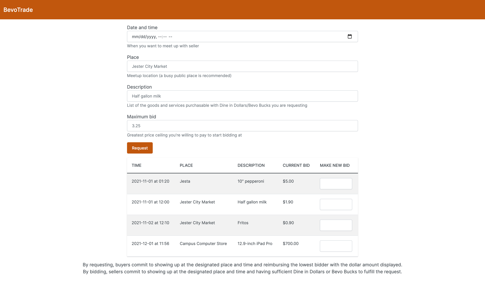

# BevoTrade

## Run
Provision a Cloud Firestore database and replace the config at the bottom of `index.js` with your own.

## Inspiration
UT Austin students who live on campus in dorms must buy the Resident Unlimited Meal Plan, which comes with $600 worth of Dine in Dollars and $200 of Bevo Bucks. Many students have trouble finding ways to spend all that money that they're forced to pay for, especially Dine in Dollars as they cannot be refunded.

## What it does
BevoTrade lets a buyer request goods purchasable with Dine in Dollars or Bevo Bucks. Sellers can then bid for the lowest amount of real cash they would accept in exchange for buying this item with their unused Dine in Dollars/Bevo Bucks for the requester. Buyers can get items at lower prices and sellers can recoup some of their money, improving the economic efficiency for everyone!

## Challenges we ran into
It took a while for me to decide on a suitable trading algorithm. At first, I wanted to do something like the Steam Community Market where the highest buyer gets matched with the lowest seller. But I realized that wouldn't work because Dine in Dollars and Bevo Bucks aren't transferrable. I decided on the current bidding process to make it as easy as possible for buyers and sellers to do exchanges. In addition, the Firebase SDK had a runtime error that I spent an hour fruitlessly debugging and that I only finally fixed by downgrading to a lower version. Finally, I accidentally closed this Devpost submission tab (and there was no unsaved changes warning alert!) so I had to rewrite all of this from scratch. (The deadline extension was a lifesaver!)

## Accomplishments that we're proud of
This was my first time building a full stack web app from scratch completely by myself. Despite this being a hackathon, I tried and managed to keep my code clean and extensible to the best of my ability, as this is something I may actually want to continue. I am also proud of the way the style looks as I customized it to fit the look and feel of UT, including the school color burnt orange.

## What we learned
This was my first time using Express to build an API server on top of Node and it turned out to be pretty straightforward. I also used Firebase and Bootstrap a long time ago so it was good to brush up on that. All in all, I learned a lot about the JavaScript ecosystem and how all the components of a website fit together from the backend to the frontend and the API layer.

## What's next for BevoTrade
If there is real demand for this, I would like to add functionality to cancel requests and contact users. I didn't include these in the minimum viable product because I would need to figure out the best way to provide security against while protecting user privacy.
